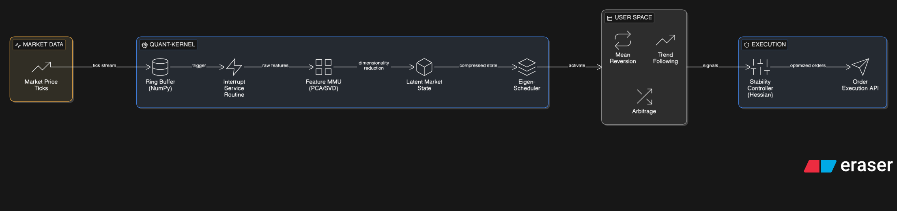

# The Quant-Kernel: An OS-Architected Trading Engine

A high-performance framework that reimagines a trading system as a Microkernel Operating System. Instead of processing data in a linear loop, it treats market ticks as Hardware Interrupts and utilizes Matrix Calculus to manage strategy execution and risk.

## System Architecture

The project is built on the principle of Separation of Concerns, mirroring a real-time operating system (RTOS) to ensure that mathematical computation never bottlenecks data ingestion.

### 1. The Interrupt Layer (Data Ingestion)

Most trading scripts fail because they "poll" data, creating latency. The Quant-Kernel treats every price update as a Hardware Interrupt.

**Mechanism**: Implements a high-speed Circular Buffer (Ring Buffer) using NumPy.
**Performance**: $O(1)$ access for the most recent $N$ ticks, ensuring the "Kernel" always has a zero-latency snapshot of market state.

### 2. The MMU (Memory Management Unit): Feature Mapping

In a traditional OS, the MMU maps virtual to physical memory. In the Quant-Kernel, the Feature MMU maps high-dimensional noise into low-dimensional "Latent States."

**Math**: Uses Principal Component Analysis (PCA) and Singular Value Decomposition (SVD).
**Efficiency**: Compresses 50+ correlated market indicators (RSI, Volatility, Volume, etc.) into the top 3 Principal Components, reducing the computational load on strategy "processes."

### 3. The Scheduler (Eigen-Dominance)

The Kernel manages a pool of strategy processes (e.g., Mean Reversion, Trend Following).

**Logic**: Calculates the Spectral Radius (largest eigenvalue) of the asset covariance matrix.
**Decision**: High Spectral Radius indicates a dominant trend; the Scheduler pre-empts noise-trading processes and allocates "CPU cycles" (Capital) to trend-following processes.

### 4. The Stability Controller (Hessian Optimization)

To prevent "overshooting" or "oscillating" in volatile markets, the Kernel uses a second-order optimization engine.

**Math**: Computes the Hessian of the Risk-Adjusted P&L.
**Mechanism**: Uses the Inverse Hessian to scale trade sizes. If the market "canyon" is too steep (high condition number), the controller automatically dampens execution to preserve capital.

## Tech Stack & Prerequisites

- **Language**: Python 3.10+ (Logic)
- **Math Engine**: NumPy / SciPy (Linear Algebra & Matrix Calculus)
- **Concurrency**: multiprocessing for process isolation and shared_memory for low-latency IPC
- **Visuals**: Matplotlib/Plotly for the "System Monitor" dashboard

## Roadmap (Learn & Build in Public)

### Phase 1: The Core (Week 1)
- [ ] Implement the InterruptHandler with a Circular Buffer.
- [ ] Build the FeatureMMU module for real-time PCA compression.

### Phase 2: The Logic (Week 2)
- [ ] Integrate Jacobian-based sensitivity analysis for portfolio risk.
- [ ] Develop the EigenScheduler for dynamic capital allocation.

### Phase 3: The Dashboard (Week 3)
- [ ] Build a CLI/Web "System Monitor" showing Volatility as "System Load."
- [ ] Backtest the engine using SVD-denoised historical data.

## Why This Project?

Standard "bots" are apps; the Quant-Kernel is infrastructure.

## Getting Started

*(To be added as the project develops)*

## License

*(To be added)*

---
*Built with the precision of an operating system and the power of matrix calculus.*